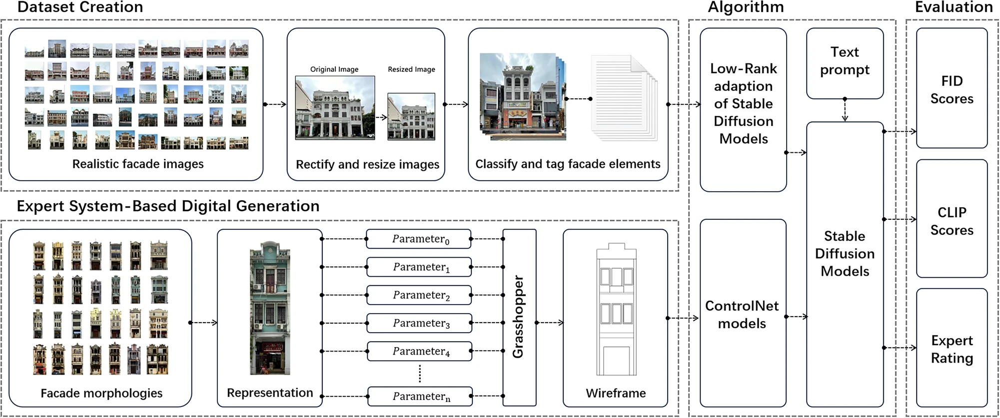
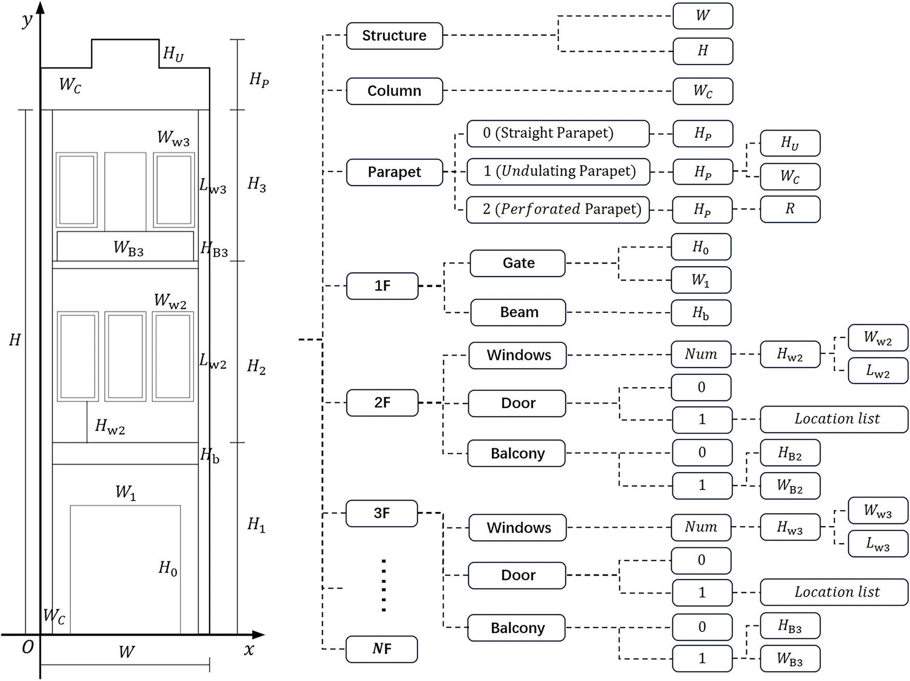
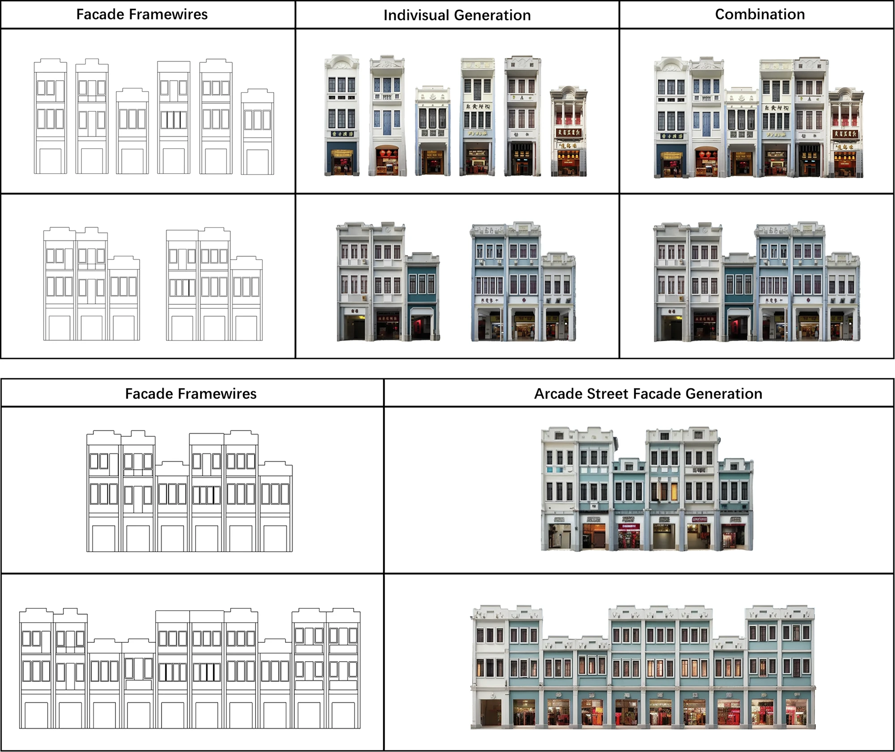

# Arcade-Facades-Generation

This repo includes:
- A dataset of arcade facade images for LoRA model training.
- Different versions of LoRA models for historical arcade facades generation using stable diffusion model.
- A Grasshopper prototype for procedural modeling of arcade facades wireframe.



Latest Paper: [Preserving architectural heritage in urban renewal: a stable diffusion model framework for automated historical facade generation](https://www.nature.com/articles/s40494-025-01826-4)

Preserving the architectural heritage of traditional historical districts is a crucial aspect of urban renewal. Traditional design workflows are time-consuming and subjective. Current data-driven design methods generate specific style images but are labor-intensive. Recent research highlights Stable Diffusion models’ potential in generating high-fidelity images based on prompts. However, research applying these models to historical districts is scarce, with challenges in creating effective prompts and training parameters. This study proposes a framework combining Stable Diffusion models with expert system-based techniques to generate architectural facades from professional prompts. We constructed a dataset of traditional arcade facades, trained Low-Rank Adaptation (LoRA) models, and integrated ControlNet models to enhance controllability. Experimental results showed our models excelled in precision, realism, and diversity. Both qualitative and quantitative evaluations, along with practical application tests, confirmed our approach aids designers and prompts engineers, contributing to the preservation of architectural heritage and the renewal of urban historical districts.

<p align="left">
  
    &nbsp;&nbsp;&nbsp;&nbsp;
  
</p>

Initial paper：[Advancing Urban Renewal: An Automated Approach to Generating Historical Arcade Facades with Stable Diffusion Models](https://arxiv.org/abs/2311.11590)

## Install

Clone this repository
```bash
git clone https://github.com/ZHEYUANK/Arcade-Facades-Generation.git
```

## Citation
If you find this repo useful, please cite our papers:
```
@article{kuang2025preserving,
  title={Preserving architectural heritage in urban renewal: a stable diffusion model framework for automated historical facade generation},
  author={Kuang, Zheyuan and Zhang, Jiaxin and Li, Yunqin and Fukuda, Tomohiro},
  journal={npj Heritage Science},
  volume={13},
  number={1},
  pages={256},
  year={2025},
  publisher={Springer International Publishing Cham}
}

@article{kuang2023advancing,
  title={Advancing urban renewal: an automated approach to generating historical arcade facades with stable diffusion models},
  author={Kuang, Zheyuan and Zhang, Jiaxin and Huang, Yiying and Li, Yunqin},
  journal={arXiv preprint arXiv:2311.11590},
  year={2023}
}
```
